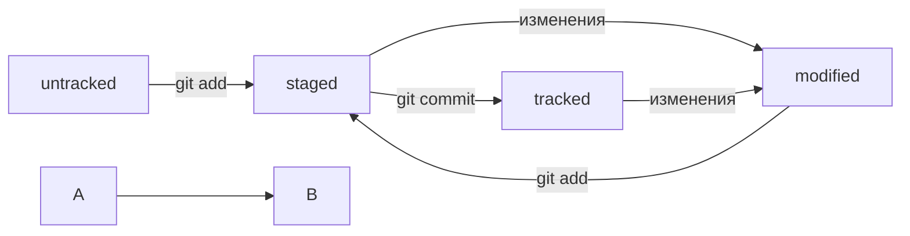

# Знакомство с  git
#### Перемещение по директориям
Работа в git происходит с файлами, расположенными в различных директориях. 
 
**Основные команды:**
* pwd - покажет текущее положение
* cd - переход в другую директорию
* ls - выводит список элементов директории
* touch - создает файл
* mkdir - создает директорию
* rm - удаляет файл
* cp - копирует файлы
* mv - перемещает файлы

#### Работа с кодом
1. Создаём директорию вне других репозиториев: *mkdir someName*
2. Перемещаемся в неё: *cd someName*
3. Инициализируем локальный репозиторий: *git init*
4. Создаём файл README.md: *git touch README.md*
5. Редактрируем его в любом графическом редакторе
6. Выводим в консоль содержимое файла README.md: *cat README.md*
7. Создаём удалённый репозиторий на платформе GitHub
8. Связываем оба репозитория: *git remote add origin git@github.com:%ИМЯ_АККАУНТА%/someName.git*
9. Добавляем список файлов, которые мы хотим сохранить: *git add*
10. Сохраняем файлы с описанием изменений: *git commit -m "Описание"*
11. Вносим изменения в удалённый репозиторий: *git push -u origin master*

